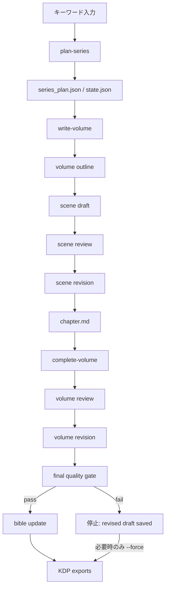

# novel-forge-kdp

ローカルLLM（Ollama OpenAI互換API）を使って、小説を「シリーズ > 巻 > 章 > シーン」で企画・設計・執筆・レビュー・改稿・出力するPython製CLIツールです。

目的は、KDPで商用出版するためのドラフト制作を、再開可能で検証しやすいワークフローにすることです。モデル能力による文学的品質の限界は残りますが、ツール側ではJSON Schema検証、品質ゲート、状態保存、RAWログ、KDP向け出力を提供します。

## 特長

- シリーズ企画から巻単位の執筆、レビュー、改稿、KDP向け出力までをCLIで実行
- 本文生成の最小単位をシーンに固定し、章・巻単位へ段階的に統合
- JSON Schema付きのLLM出力検証
- Ollama OpenAI互換APIの `response_format={"type":"json_object"}` に対応
- thinkingモデル対策として `think: false` を送信
- Markdown code fence付きJSONや `{result: ...}` 形式など、実モデルで出がちなJSON揺れを限定的に補正
- `state.json` による中断・再開
- `raw_logs/*.json` にLLMリクエスト/レスポンスを保存
- `bible.json` にキャラクター、用語、伏線、継続性メモを蓄積
- `manuscript.md`, `kdp.txt`, `book.epub`, `metadata.json`, 章別Markdownを生成
- slug安全化、パストラバーサル拒否、既存シリーズ衝突拒否
- atomic write + `.bak` による状態ファイル保護
- 出版準備判定と重大issue検出による品質ゲート
- `--force` 指定時のみ品質ゲートを越えて検証用出力

## ワークフロー



## ドキュメント

- `README.md`: 機能概要、セットアップ、CLI、設計方針
- `docs/SPECIFICATION.md`: 実装レベルに踏み込まない詳細仕様書
- `docs/OPERATIONS.md`: 実モデル運用の手順、品質ゲート失敗時対応、リリース前チェック

## セットアップ

Python 3.14以上が必要です。

```bash
uv sync
uv run python --version
```

Ollama側にはOpenAI互換APIが必要です。既定値は以下です。

- Base URL: `http://ws1.local:11434`
- Model: `qwen3.6:35b-a3b-mtp-q4_K_M`
- Timeout: `3600s`
- Max tokens: `24576`

別のOllamaホストやモデルを使う場合は、各CLIで `--ollama-url`, `--model`, `--timeout` を指定します。

```bash
uv run novel-forge-kdp probe-model \
  --ollama-url http://localhost:11434 \
  --model qwen3.6:35b-a3b-mtp-q4_K_M \
  --timeout 3600
```

## クイックスタート

モデル接続とJSON応答を確認します。

```bash
uv run novel-forge-kdp probe-model
```

シリーズを企画します。

```bash
uv run novel-forge-kdp plan-series "地方港町 書店 珈琲 魔法契約 家族再生 KDP向けライト文芸ファンタジー"
```

出力されたslugを使って1巻をシーン単位で生成します。

```bash
uv run novel-forge-kdp write-volume <series-slug>
```

巻全体レビュー、巻全体改稿、台帳更新、KDP向け出力まで進めます。

```bash
uv run novel-forge-kdp complete-volume <series-slug>
```

進捗を確認します。

```bash
uv run novel-forge-kdp status <series-slug>
```

## 共通CLIオプション

LLMを使うコマンドでは、必要に応じて以下を指定できます。

- `--workspace PATH`: シリーズ作業フォルダの親。既定は `workspace`
- `--ollama-url URL`: Ollama OpenAI互換APIのURL。既定は `http://ws1.local:11434`
- `--model MODEL`: 使用モデル名。既定は `qwen3.6:35b-a3b-mtp-q4_K_M`
- `--timeout SECONDS`: LLMリクエストのタイムアウト秒数。既定は `3600`

LLMを使わない `status` と `export-volume` は `--workspace` と `--volume` だけを扱います。

## CLIコマンド

### `probe-model`

Ollama OpenAI互換APIへ接続し、短いJSON応答を実際に検証します。

```bash
uv run novel-forge-kdp probe-model [--ollama-url URL] [--model MODEL] [--timeout SECONDS]
```

用途:

- モデル名の確認
- OpenAI互換APIの疎通確認
- JSON parseとSchema検証の事前確認

### `plan-series`

キーワードからシリーズ企画を生成し、`workspace/<slug>/` を作成します。

```bash
uv run novel-forge-kdp plan-series "キーワード" [--workspace PATH] [--ollama-url URL] [--model MODEL] [--timeout SECONDS]
```

生成物:

- `series_plan.json`
- `state.json`
- `raw_logs/`

既存slugがある場合は上書きせず停止します。

### `write-volume`

指定シリーズの巻アウトライン、シーン初稿、シーンレビュー、シーン改稿、章Markdownを生成します。

```bash
uv run novel-forge-kdp write-volume <series-slug> [--workspace PATH] [--volume N] [--max-scenes N] [--ollama-url URL] [--model MODEL] [--timeout SECONDS]
```

`--max-scenes` はスモーク検証用です。通常運用では未指定にします。

### `complete-volume`

巻全体レビュー、巻全体改稿、必要に応じた改稿後再レビュー、シリーズ台帳更新、KDP向け出力を実行します。

```bash
uv run novel-forge-kdp complete-volume <series-slug> [--workspace PATH] [--volume N] [--force] [--ollama-url URL] [--model MODEL] [--timeout SECONDS]
```

品質ゲートに失敗した場合、改稿済み原稿は保存したうえで標準では停止します。検証目的でどうしても出力したい場合のみ `--force` を指定します。

```bash
uv run novel-forge-kdp complete-volume <series-slug> --force
```

### `continue-series`

現在巻が未完了なら完成処理を行い、現在巻が完成済みなら次巻を生成します。

```bash
uv run novel-forge-kdp continue-series <series-slug> [--workspace PATH] [--ollama-url URL] [--model MODEL] [--timeout SECONDS]
```

計画巻数を超える続巻生成は拒否します。

### `export-volume`

既存の改稿済み原稿からKDP向け出力だけを再生成します。

```bash
uv run novel-forge-kdp export-volume <series-slug> [--workspace PATH] [--volume N]
```

### `status`

`state.json` を読み、現在の進捗をJSONで表示します。

```bash
uv run novel-forge-kdp status <series-slug> [--workspace PATH]
```

## 作業フォルダ構造

```text
workspace/<series-slug>/
  state.json
  state.json.bak
  series_plan.json
  bible.json
  raw_logs/
  volume_001/
    outline.json
    volume_review.json
    volume_review_final.json
    volume_revised.json
    volume_revised.md
    chapters/
      chapter_001/
        scene_001.draft.json
        scene_001.review.json
        scene_001.revised.json
        scene_001.md
        chapter.md
    exports/
      manuscript.md
      kdp.txt
      book.epub
      metadata.json
      chapters/
        chapter_001.md
```

## 出力ファイル

- `volume_revised.md`: 巻全体改稿後の最終Markdown原稿
- `exports/manuscript.md`: KDP向けMarkdownドラフト
- `exports/kdp.txt`: Markdown見出し記号を除去したプレーンテキスト
- `exports/book.epub`: KDP確認用EPUBドラフト
- `exports/metadata.json`: タイトルなどの簡易メタデータ
- `exports/chapters/chapter_NNN.md`: 巻改稿後の最終原稿から切り出した章別Markdown
- `chapters/chapter_NNN/chapter.md`: シーン改稿済み本文を章単位にまとめた中間原稿

`book.epub` は確認用ドラフトです。商用品質の最終EPUBには、別途epubcheck、表紙、CSS、奥付、詳細メタデータ調整を行ってください。

## 品質ゲート

`complete-volume` は以下の場合に標準では停止します。

- 巻レビューが `ready_for_publication: false` を返した
- 改稿後再レビューでも `ready_for_publication: false` のまま
- `issues[].severity` に `major`, `critical`, `blocker` が含まれる
- 改稿後本文に `##` 章見出しがない
- 改稿後本文の `##` 章見出し数がアウトライン章数と一致しない

停止時も `volume_revised.md` やレビューJSONは保存されます。人間が確認して再実行するか、検証目的に限って `--force` を使います。

## 構造制約

実モデルの暴走を避けるため、現在は小さなKDPドラフト生成に寄せています。

- シリーズ最大3巻
- 各巻最大2章
- 各章最大2シーン
- 巻番号はシリーズ計画に存在する番号のみ許可
- アウトラインの巻番号が要求巻番号と違う場合は拒否
- 章番号重複は拒否
- 同一章内のシーン番号重複は拒否
- 章0件、シーン0件は拒否
- cached `outline.json` でも同じruntime validationを実行

## 安全性とデータ保全

- slugは安全な文字列に正規化します
- `../outside` のようなパストラバーサルは拒否します
- シーン本文パスがシリーズディレクトリ外を指す場合は拒否します
- `state.json` や主要JSONは一時ファイルへ書き、fsync後に置換します
- 既存JSONは `.bak` として退避します
- 暗黙のフォールバックより明示エラーを優先します
- RAWログには未公開原稿、プロット、モデル応答が平文保存されます。公開・共有・バックアップ時は扱いに注意してください

## 実測済みモデル挙動

対象環境:

- Ollama URL: `http://ws1.local:11434`
- API: `/v1/chat/completions`
- Model: `qwen3.6:35b-a3b-mtp-q4_K_M`
- 想定 context length: `131072`
- 想定 max tokens: `24576`
- ツール側 timeout: `3600s`

確認済み:

- `response_format={"type":"json_object"}` と「JSONのみ」指示で短いJSONを返す
- 約2万字級の長文入力でもJSON parse成功
- 存在しないモデルはHTTP 404として明示エラー
- 短すぎるtimeoutは `TimeoutError` として明示エラー
- thinkingモデルで `message.reasoning` 側に出力が逃げる問題は、`think: false` 送信で回避

## トラブルシューティング

### `probe failed: LLM did not return valid JSON`

原因候補:

- モデルがJSON以外の文章を返した
- thinkingモデルが `message.content` ではなく推論欄へ出力した
- モデルがOpenAI互換APIの `response_format` に十分従っていない

対処:

- `probe_logs/*.json` を確認
- 別モデルで `--model` を指定
- Ollamaのモデルロード状態を確認
- 既定クライアントは `think: false` を送信済み

### `LLM HTTP error 404`

モデル名が存在しないか、Ollama側にpullされていません。

```bash
ollama list
ollama pull <model>
```

### `LLM request timed out after ...s`

モデルが遅い、入力が大きい、またはCPU実行で時間がかかっています。

対処:

- `--timeout` を増やす
- 小さいモデルを使う
- `write-volume --max-scenes 1` でスモーク検証する

### `volume review has major final review issues`

ツールの品質ゲートが働いています。`volume_revised.md` と `volume_review*.json` を確認し、必要ならプロンプトや原稿を調整して再実行します。

検証用に出力だけ必要な場合:

```bash
uv run novel-forge-kdp complete-volume <series-slug> --force
```

### `revised volume chapter count mismatch`

巻全体改稿でLLMがアウトラインと違う章数を返しています。`volume_revised.md` の `##` 章見出し数を確認してください。ツールは章構造の破損を防ぐため停止します。

## スモーク検証

LLMを使わず、最小ワークスペースを作ってexportだけ確認できます。

```bash
uv run python scripts/make_smoke_workspace.py --root /tmp/novel-forge-smoke --slug smoke-one-scene
uv run novel-forge-kdp export-volume smoke-one-scene --workspace /tmp/novel-forge-smoke
```

`--help` は副作用なしで表示されます。

```bash
uv run python scripts/make_smoke_workspace.py --help
```

## 開発コマンド

```bash
uv run pytest -q
uv run python -m compileall -q src tests scripts
uv build
git diff --check
```

セキュリティ簡易確認の観点:

- hardcoded secretがないこと
- `shell=True` / `os.system` がないこと
- `eval` / `exec` がないこと
- `pickle` がないこと
- SQL文字列組み立てがないこと

## プロンプトとSchema

プロンプトはMarkdownで管理します。

```text
src/novel_forge_kdp/prompts/*.md
```

SchemaはJSON Schemaで管理します。

```text
src/novel_forge_kdp/schemas/*.json
```

LLM呼び出し時は、用途別Schemaをプロンプト末尾にも添付します。OpenAI互換APIの `response_format` だけに依存しません。

## 実装済みチェックリスト

- [x] Python 3.14 + uv プロジェクト
- [x] Ollama OpenAI互換API連携
- [x] モデル疎通確認CLI
- [x] JSON Schema検証
- [x] Markdown prompt管理
- [x] シリーズ企画生成
- [x] 巻アウトライン生成
- [x] シーン初稿・レビュー・改稿
- [x] 章Markdown生成
- [x] 巻全体レビュー・巻全体改稿
- [x] 改稿後章数検証
- [x] 品質ゲート
- [x] シリーズ台帳更新
- [x] KDP向けMarkdown/text/EPUB出力
- [x] 次巻継続フロー
- [x] state.jsonによる再開
- [x] atomic write + `.bak`
- [x] slug/path安全化
- [x] パストラバーサル拒否
- [x] cached outline runtime validation
- [x] TDD/異常系テスト
