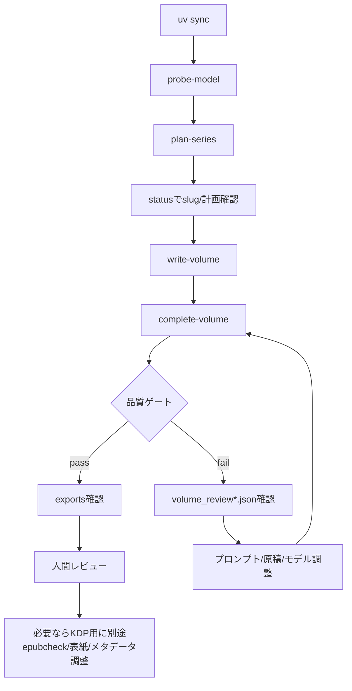

# Production Operation Runbook

`novel-forge-kdp` を実モデルで運用するときの手順書です。READMEは機能説明、この文書は実行順・確認点・失敗時対応に絞ります。

## 前提

- Python 3.14以上
- `uv` が使えること
- OllamaのOpenAI互換APIが起動していること
- 使用モデルがOllamaに存在すること
- 未公開原稿とRAWログを保存できる安全な作業ディレクトリで実行すること

既定モデル設定:

```text
ollama_url: http://ws1.local:11434
model: qwen3.6:35b-a3b-mtp-q4_K_M
timeout: 3600
```

別環境では各コマンドへ `--ollama-url`, `--model`, `--timeout` を明示してください。

## 標準運用フロー



## 1. 環境確認

```bash
uv sync
uv run python --version
uv run novel-forge-kdp probe-model
```

期待結果:

```text
{'ok': True, 'note': '...'}
```

失敗したら、まず以下を確認します。

```bash
ollama list
curl -s http://ws1.local:11434/v1/models | head
```

## 2. シリーズ企画

```bash
uv run novel-forge-kdp plan-series "地方港町 書店 珈琲 魔法契約 家族再生 KDP向けライト文芸ファンタジー"
```

確認するファイル:

- `workspace/<slug>/series_plan.json`
- `workspace/<slug>/state.json`
- `workspace/<slug>/raw_logs/*_series_plan.json`

確認観点:

- slugが意図通りか
- `planned_volumes` が最大3巻以内か
- 企画のジャンル、読者、売りがKDP向けに成立しているか

## 3. 1巻執筆

```bash
uv run novel-forge-kdp write-volume <series-slug>
```

長時間かかる場合があります。スモーク検証だけなら以下を使います。

```bash
uv run novel-forge-kdp write-volume <series-slug> --max-scenes 1
```

確認するファイル:

- `volume_001/outline.json`
- `volume_001/chapters/chapter_NNN/scene_NNN.draft.json`
- `volume_001/chapters/chapter_NNN/scene_NNN.review.json`
- `volume_001/chapters/chapter_NNN/scene_NNN.revised.json`
- `volume_001/chapters/chapter_NNN/scene_NNN.md`
- `volume_001/chapters/chapter_NNN/chapter.md`

確認観点:

- アウトラインが2章以内、各章2シーン以内か
- シーンごとに初稿、レビュー、改稿が揃っているか
- `status` で全シーンが `revised` になっているか

```bash
uv run novel-forge-kdp status <series-slug>
```

## 4. 巻完成とKDP向け出力

```bash
uv run novel-forge-kdp complete-volume <series-slug>
```

成功時の確認ファイル:

- `volume_001/volume_review.json`
- `volume_001/volume_revised.json`
- `volume_001/volume_revised.md`
- `volume_001/exports/manuscript.md`
- `volume_001/exports/kdp.txt`
- `volume_001/exports/metadata.json`
- `volume_001/exports/book.epub`
- `volume_001/exports/chapters/chapter_NNN.md`
- `bible.json`

確認コマンド例:

```bash
python - <<'PY'
from pathlib import Path
import json, zipfile
root = Path('workspace/<series-slug>/volume_001')
print('manuscript:', (root/'exports/manuscript.md').stat().st_size)
print('kdp:', (root/'exports/kdp.txt').stat().st_size)
print('metadata:', json.loads((root/'exports/metadata.json').read_text(encoding='utf-8')))
with zipfile.ZipFile(root/'exports/book.epub') as zf:
    print('\n'.join(zf.namelist()))
print('chapters:', sorted(p.name for p in (root/'exports/chapters').glob('chapter_*.md')))
PY
```

## 5. 品質ゲート失敗時

代表的な停止メッセージ:

```text
volume review says not ready for publication after revision; revised draft saved, rerun with force=True to export anyway
```

```text
volume review has major final review issues; revised draft saved, rerun with force=True to export anyway
```

確認するファイル:

- `volume_001/volume_review.json`
- `volume_001/volume_review_final.json`
- `volume_001/volume_revised.md`

対応方針:

1. `issues` の `severity` と `point` を読む
2. プロンプト、モデル、原稿を調整する
3. 再度 `complete-volume` を実行する
4. 検証用に出力だけ必要なら `--force` を使う

```bash
uv run novel-forge-kdp complete-volume <series-slug> --force
```

`--force` は出版可判定ではありません。KDP提出前には必ず人間レビューを行ってください。

## 6. 構造不整合で停止した場合

### `volume outline number mismatch`

要求巻番号とLLMが返した `volume_number` が違います。キャッシュ済み `outline.json` を確認してください。

### `too many chapters in outline` / `too many scenes in outline chapter`

LLMが規模制約を超えています。プロンプトやモデルを見直してください。cached `outline.json` でも拒否されます。

### `duplicate chapter number` / `duplicate scene number`

LLMが重複番号を返しています。手修正より、プロンプト改善または再生成を優先します。

### `revised volume chapter count mismatch`

巻全体改稿後の `##` 章見出し数がアウトライン章数と一致していません。章構造が壊れるため、ツールは出力を停止します。

## 7. 既存原稿から出力だけ再生成

`volume_revised.md` を修正した後、KDP向け出力だけ作り直す場合:

```bash
uv run novel-forge-kdp export-volume <series-slug>
```

`exports/chapters/` は `volume_revised.md` の `##` 見出しから再切り出しされ、古い `chapter_*.md` は削除されます。

## 8. 続巻生成

```bash
uv run novel-forge-kdp continue-series <series-slug>
```

挙動:

- 現在巻が未完成なら `complete-volume` 相当を実行
- 現在巻が完成済みなら次巻へ進む
- シリーズ計画の巻数を超える場合は拒否

## 9. RAWログの扱い

`raw_logs/*.json` には以下が含まれます。

- プロンプト全文
- JSON Schema
- 未公開原稿
- モデル応答
- エラー時のレスポンス本文

公開リポジトリへ入れないでください。バックアップ時も未公開原稿として扱います。

## 10. リリース前チェック

```bash
uv run pytest -q
uv run python -m compileall -q src tests scripts
uv build
git diff --check
```

追加で確認するもの:

```bash
git status --short
git diff --stat
```

セキュリティ観点:

- APIキー、トークン、パスワード、接続文字列が入っていないこと
- `raw_logs/` や `workspace/` の未公開原稿をコミットしていないこと
- `shell=True`, `os.system`, `eval`, `exec`, `pickle` を追加していないこと

## 11. KDP提出前の人間レビュー

ツールが生成するEPUBは確認用ドラフトです。KDP提出前には最低限以下を確認してください。

- 冒頭数ページの読み味
- 章タイトルと目次相当の整合
- 登場人物名の揺れ
- 伏線・魔法ルール・契約条件の矛盾
- 結末が巻単位で閉じているか
- `kdp.txt` にMarkdown見出し記号が残っていないか
- EPUBをビューアで開けるか
- 表紙、著者名、奥付、権利表記、販売説明文

## 12. よく使う一括コマンド

新シリーズを最後まで試す例:

```bash
slug=$(
  uv run novel-forge-kdp plan-series "山間の温泉街 古道具屋 手紙 魔法契約 失われた家族 KDP向けライト文芸ファンタジー" \
  | sed -E 's#.*/##'
)
uv run novel-forge-kdp write-volume "$slug"
uv run novel-forge-kdp complete-volume "$slug"
uv run novel-forge-kdp status "$slug"
```

上記はshell依存の簡易例です。失敗時は各ステップを分けて実行し、`raw_logs/` とレビューJSONを確認してください。
