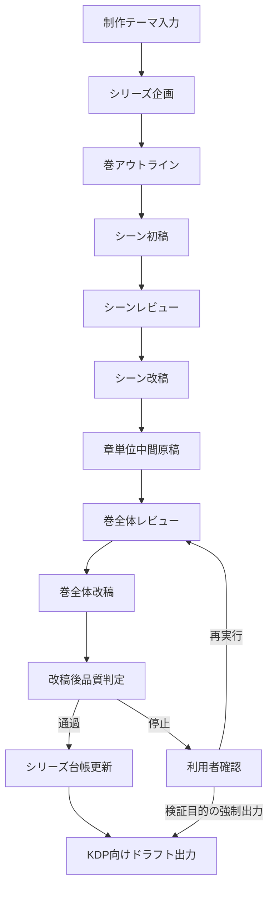

# novel-forge-kdp 詳細仕様書

## 1. 文書の位置づけ

本書は `novel-forge-kdp` の詳細仕様書です。利用者視点・業務仕様・入出力仕様・制約・品質要件を定義します。

本書は詳細設計書ではありません。ソースコード構成、内部関数、クラス、モジュール分割、アルゴリズム実装、ライブラリ呼び出し手順などの実装レベルの記述は対象外です。

## 2. システム概要

`novel-forge-kdp` は、ローカルLLMを利用してKDP向け小説ドラフトを制作するCLIツールです。小説制作を「シリーズ」「巻」「章」「シーン」の単位で管理し、企画、アウトライン作成、シーン執筆、レビュー、改稿、巻全体統合、KDP向け出力までを支援します。

本システムは小説の最終出版判断を自動化しません。出版可否、文学的品質、販売戦略、権利確認、KDP提出作業は利用者が最終判断します。

## 3. 目的

本システムの目的は以下です。

- KDP向け小説ドラフト制作の手順を再現可能にする
- 長時間のLLM生成を中断・再開可能にする
- LLM出力を構造化し、破損した成果物の混入を抑制する
- シーン単位、巻単位、シリーズ単位のレビューと改稿を制作工程に組み込む
- KDP提出前の確認に使えるMarkdown、プレーンテキスト、EPUBドラフトを出力する
- 未公開原稿、プロット、レビュー結果をローカル作業領域に集約する

## 4. 対象範囲

対象範囲は以下です。

- シリーズ企画の生成
- 巻アウトラインの生成
- シーン初稿の生成
- シーンレビューの生成
- シーン改稿の生成
- 章単位の中間原稿生成
- 巻全体レビューの生成
- 巻全体改稿の生成
- 改稿後レビューに基づく品質ゲート
- シリーズ台帳の更新
- KDP向けドラフト出力
- 進捗状態の保存と参照
- 既存原稿からの再出力
- 続巻生成の制御

対象外は以下です。

- KDPへの直接アップロード
- 表紙制作
- ISBN、著者情報、税務情報など出版アカウント管理
- EPUBの商用品質保証
- 校正者・編集者の代替
- 著作権、商標、権利侵害の完全判定
- クラウド同期、複数利用者による同時編集
- ニュース、SNS、外部市場データを利用した売上予測

## 5. 利用者

想定利用者は以下です。

- ローカルLLMを使って小説ドラフトを制作する個人制作者
- KDP向けにシリーズ小説の企画から原稿までを試作したい制作者
- LLM生成結果をログとして残し、プロンプト改善や再生成判断に使いたい制作者
- 最終的な編集・校正・出版判断を自分で行う利用者

## 6. 利用環境

本システムはコマンドラインから利用します。

前提条件は以下です。

- Python実行環境が利用可能であること
- パッケージ管理ツールが利用可能であること
- OllamaのOpenAI互換APIが利用可能であること
- 利用するLLMモデルがローカル環境に存在すること
- 未公開原稿を保存できるローカル作業領域があること

## 7. 用語定義

- シリーズ: 複数巻を含む小説企画の単位
- 巻: シリーズ内の1冊分の原稿単位
- 章: 巻を構成する読書上の区切り
- シーン: 本文生成とレビューの最小単位
- シリーズ台帳: 登場人物、用語、伏線、継続性メモを蓄積する情報
- アウトライン: 巻の章構成、シーン構成、目的、対立、結末をまとめた計画
- 品質ゲート: レビュー結果に基づいてKDP向け出力を許可または停止する判定
- RAWログ: LLMとの入出力内容を保存した検証用ログ
- KDP向けドラフト: KDP提出前の確認に使うMarkdown、テキスト、EPUB形式の出力

## 8. 全体業務フロー

## 9. 状態遷移仕様

### 9.1 シリーズ状態

シリーズは作成後、現在処理対象の巻番号を持ちます。現在巻が完成済みの場合、続巻処理によって次の計画巻へ進みます。計画済み巻数を超える巻は作成しません。

### 9.2 巻状態

巻の状態は以下の順序で進みます。

1. 計画済み
2. アウトライン作成済み
3. シーン改稿完了済み
4. 巻レビュー済み
5. 巻改稿完了済み

巻改稿完了済みの巻は、KDP向けドラフト出力の対象になります。レビュー結果が基準を満たさない場合、巻レビュー済みの状態で停止し、利用者確認を求めます。

### 9.3 シーン状態

シーンの状態は以下の順序で進みます。

1. 計画済み
2. 初稿生成済み
3. レビュー済み
4. 改稿済み

巻全体の完成処理は、対象巻の全シーンが改稿済みであることを前提とします。

## 10. 機能仕様

### 10.1 モデル疎通確認

本システムは、LLMがJSON形式の応答を返せることを確認する機能を提供します。

入力:

- LLM API URL
- モデル名
- タイムアウト秒数

出力:

- 疎通成功を示す構造化応答
- 失敗時の明示的なエラー

主な判定:

- APIに接続できること
- 対象モデルが利用できること
- 応答がJSONとして解釈できること
- 必須項目を含むこと

### 10.2 シリーズ企画生成

利用者が入力した制作テーマから、シリーズ企画を生成します。

入力:

- 制作テーマまたはキーワード
- 作業領域
- LLM接続設定

出力:

- シリーズ名
- slug
- ログライン
- ジャンル
- 対象読者
- テーマ
- 販売上の訴求点
- 世界設定
- 主要キャラクター
- 計画巻一覧
- 初期進捗状態

制約:

- シリーズは最大3巻とします
- 計画巻は1巻以上必要です
- 既存シリーズと同じslugは作成できません
- slugは安全な作業領域名として扱える必要があります

### 10.3 巻アウトライン生成

対象巻の章構成とシーン構成を生成します。

入力:

- シリーズ企画
- 対象巻番号
- LLM接続設定

出力:

- 巻番号
- 巻タイトル
- 章一覧
- 各章の目的
- シーン一覧
- 各シーンの視点、目的、対立、結果

制約:

- 巻番号は要求された巻番号と一致する必要があります
- 計画に存在しない巻番号は指定できません
- 各巻は最大2章です
- 各章は最大2シーンです
- 章番号は巻内で重複できません
- シーン番号は同一章内で重複できません
- 章0件、シーン0件は許可しません

### 10.4 シーン初稿生成

アウトラインに基づき、シーン単位の初稿を生成します。

入力:

- シリーズ企画
- 巻アウトライン
- 対象シーン情報
- LLM接続設定

出力:

- シーンタイトル
- シーン本文

制約:

- 対象シーンはアウトラインに存在する必要があります
- 出力は構造化されている必要があります
- 空本文は許可しません

### 10.5 シーンレビュー生成

シーン初稿を評価し、改善点を生成します。

入力:

- シーン初稿

出力:

- 評価点
- 問題点一覧
- 改善提案
- 出版準備観点の判定

制約:

- 問題点は重大度を持つ必要があります
- レビュー結果は後続の改稿に利用できる形式である必要があります

### 10.6 シーン改稿生成

シーン初稿とレビュー結果をもとに改稿本文を生成します。

入力:

- シーン初稿
- シーンレビュー

出力:

- 改稿後タイトル
- 改稿後本文

制約:

- 空本文は許可しません
- 改稿後シーンは章単位中間原稿に統合できる必要があります

### 10.7 章単位中間原稿生成

改稿済みシーンを章ごとに結合し、章単位の中間原稿を生成します。

入力:

- 改稿済みシーン群
- 章情報

出力:

- 章見出し
- シーン本文を結合した章本文

制約:

- 未改稿のシーンは完成原稿の対象にしません
- 存在しないシーン本文はエラーとします

### 10.8 巻全体レビュー生成

章単位中間原稿を統合した巻原稿をレビューします。

入力:

- シリーズ企画
- 巻原稿

出力:

- 評価点
- 出版準備判定
- 問題点一覧
- 改善提案

制約:

- 問題点は重大度を持つ必要があります
- 出版準備判定は品質ゲートに利用されます

### 10.9 巻全体改稿生成

巻全体レビューをもとに、巻単位の統合改稿を生成します。

入力:

- 巻原稿
- 巻レビュー
- 期待される章数

出力:

- 改稿後巻タイトル
- 改稿後巻本文

制約:

- 改稿後本文には章見出しが必要です
- 章見出し数はアウトラインの章数と一致する必要があります
- 空本文は許可しません
- 改稿後タイトルは以後の出力メタデータに反映されます

### 10.10 品質ゲート

巻全体改稿後、レビュー結果に基づいてKDP向け出力可否を判定します。

標準では以下の場合に停止します。

- 出版準備判定が未達である
- 重大度が `major` 以上の問題が存在する
- 改稿後本文に章見出しが存在しない
- 改稿後本文の章数がアウトラインと一致しない

停止時の扱い:

- 改稿後原稿とレビュー結果は保存します
- KDP向け出力は行いません
- 利用者は内容確認後、再実行または検証用強制出力を選択できます

強制出力:

- 利用者が明示した場合のみ実行します
- 強制出力は出版可判定ではありません
- 人間レビューを省略する根拠にはなりません

### 10.11 シリーズ台帳更新

巻改稿後原稿をもとに、シリーズ台帳を更新します。

入力:

- 既存のシリーズ台帳
- 巻改稿後原稿

出力:

- 登場人物情報
- 用語情報
- 伏線情報
- 継続性メモ
- 次巻以降への注意点

制約:

- 台帳はシリーズ継続性を支援する補助情報であり、出版可否の直接判定には使いません

### 10.12 KDP向けドラフト出力

巻改稿後原稿をKDP確認用の複数形式へ出力します。

出力:

- Markdown原稿
- プレーンテキスト原稿
- EPUBドラフト
- 簡易メタデータ
- 章別Markdown

制約:

- プレーンテキストではMarkdown見出し記号を除去します
- 章別Markdownは改稿後本文の章見出しを基準に分割します
- EPUBは確認用ドラフトであり、商用品質保証の対象ではありません

### 10.13 進捗確認

シリーズの進捗状態を表示します。

出力:

- シリーズ情報
- 現在巻番号
- 巻ごとの状態
- シーンごとの状態
- 生成済み原稿の参照情報

### 10.14 既存原稿からの再出力

既存の改稿後原稿をもとにKDP向けドラフトを再生成します。

入力:

- シリーズslug
- 巻番号

出力:

- 更新されたKDP向けドラフト一式

制約:

- 改稿後原稿が存在する場合はそれを優先します
- 章別Markdownは再生成時に最新の章見出しに合わせます

### 10.15 続巻生成

現在巻の状態に応じて処理を継続します。

挙動:

- 現在巻が未完成の場合、現在巻の完成処理を行います
- 現在巻が完成済みの場合、次の計画巻へ進みます
- 計画巻数を超える巻は作成しません

## 11. 入出力仕様

### 11.1 入力種別

本システムの主な入力は以下です。

- 制作テーマまたはキーワード
- シリーズslug
- 巻番号
- 作業領域
- LLM API URL
- モデル名
- タイムアウト秒数
- 強制出力指定
- スモーク検証用の処理シーン数上限

### 11.2 出力種別

本システムの主な出力は以下です。

- シリーズ企画
- 進捗状態
- 巻アウトライン
- シーン初稿
- シーンレビュー
- シーン改稿
- 章単位中間原稿
- 巻レビュー
- 巻改稿後原稿
- シリーズ台帳
- KDP向けドラフト
- RAWログ
- エラーメッセージ

### 11.3 成果物の保存方針

成果物はシリーズごとの作業領域に保存します。シリーズごとの成果物はslugで分離されます。重要な状態情報は更新時に直前版を退避し、途中失敗時の復旧可能性を高めます。

## 12. データ項目仕様

### 12.1 シリーズ企画

シリーズ企画は以下の情報を持ちます。

- タイトル
- slug
- ログライン
- ジャンル
- 対象読者
- テーマ一覧
- 販売上の訴求点一覧
- 世界設定
- 主要キャラクター一覧
- 計画巻一覧

### 12.2 世界設定

世界設定は以下の情報を持ちます。

- 概要
- ルール一覧

### 12.3 キャラクター

キャラクターは以下の情報を持ちます。

- 名前
- 役割
- 物語上の変化または成長

### 12.4 計画巻

計画巻は以下の情報を持ちます。

- 巻番号
- 巻タイトル
- 巻の前提

### 12.5 巻アウトライン

巻アウトラインは以下の情報を持ちます。

- 巻番号
- 巻タイトル
- 章一覧

### 12.6 章

章は以下の情報を持ちます。

- 章番号
- 章タイトル
- 章の目的
- シーン一覧

### 12.7 シーン

シーンは以下の情報を持ちます。

- シーン番号
- シーンタイトル
- 視点
- 目的
- 対立
- 結果

### 12.8 レビュー

レビューは以下の情報を持ちます。

- 評価点
- 出版準備判定
- 問題点一覧
- 改善提案

問題点は以下の情報を持ちます。

- 重大度
- 指摘内容

### 12.9 シリーズ台帳

シリーズ台帳は以下の情報を持ちます。

- 登場人物メモ
- 用語メモ
- 伏線メモ
- 継続性メモ
- 次巻以降への注意点

## 13. 制約仕様

### 13.1 規模制約

- シリーズは最大3巻です
- 各巻は最大2章です
- 各章は最大2シーンです
- 最小構成は1巻、1章、1シーンです

### 13.2 番号制約

- 巻番号は1以上です
- 章番号は1以上です
- シーン番号は1以上です
- 巻番号はシリーズ計画に存在する必要があります
- アウトラインの巻番号は要求巻番号と一致する必要があります
- 章番号は巻内で一意です
- シーン番号は同一章内で一意です

### 13.3 文字列制約

- タイトル、slug、ログライン、本文などの主要文字列は空にできません
- slugは安全な作業領域名として扱える必要があります
- パスとして危険な値は拒否します

### 13.4 章構造制約

- 巻改稿後本文には章見出しが必要です
- 章見出し数はアウトライン章数と一致する必要があります
- 章別出力は巻改稿後本文の章見出しに基づきます

## 14. エラー仕様

本システムは、処理継続により成果物が破損する可能性がある場合、暗黙に補完せず明示的に停止します。

代表的なエラー分類は以下です。

- モデル接続エラー
- モデル応答タイムアウト
- 非JSON応答
- 構造化応答の検証失敗
- 既存シリーズ衝突
- 作業領域外参照
- 巻番号不一致
- 計画外巻番号
- 章またはシーンの重複
- 章またはシーンの上限超過
- 未改稿シーンの混入
- 原稿ファイル欠落
- 品質ゲート不通過

## 15. セキュリティ仕様

### 15.1 ローカル保存

本システムは未公開原稿、プロット、レビュー、LLM応答をローカル作業領域に保存します。これらは機密情報として扱います。

### 15.2 パス安全性

作業領域外への書き込みや参照を防ぐ必要があります。slugや原稿参照が作業領域外を指す場合、処理を拒否します。

### 15.3 認証情報

APIキー、トークン、パスワード、接続文字列などの認証情報を成果物やログに含めない運用を前提とします。利用者は公開前にログと作業領域を確認する必要があります。

### 15.4 RAWログ

RAWログにはプロンプト全文、未公開原稿、モデル応答、エラー情報が含まれる可能性があります。公開リポジトリ、共有ストレージ、外部バックアップへの混入を避けます。

## 16. 非機能要件

### 16.1 再開性

長時間生成の途中で失敗しても、完了済みステップを再利用して再開できることを重視します。

### 16.2 検証可能性

LLM入出力、レビュー結果、改稿結果、状態情報を保存し、後から生成過程を検証できることを重視します。

### 16.3 明示的失敗

不完全な原稿、構造不一致、重大なレビュー指摘がある場合、静かに出力を続行せず、明示的に失敗します。

### 16.4 ローカル完結

制作データはローカル作業領域で管理します。外部サービスへの送信は、利用者が指定したLLM APIへのリクエストに限定します。

### 16.5 運用単純性

CLIから少ない手順で標準フローを実行できることを重視します。複数人同時編集や複雑な権限管理は対象外です。

## 17. 品質要件

### 17.1 原稿品質

ツールは以下の品質向上手段を提供します。

- シーン単位のレビュー
- シーン単位の改稿
- 巻全体レビュー
- 巻全体改稿
- 改稿後の品質ゲート
- シリーズ台帳による継続性支援

ただし、最終的な文章品質、読者適合性、商品性は利用者が確認します。

### 17.2 構造品質

ツールは以下の構造品質を担保します。

- シリーズ、巻、章、シーンの階層が成立すること
- 巻番号、章番号、シーン番号が整合すること
- 章数がアウトラインと改稿後本文で一致すること
- KDP向け出力に必要な成果物が揃うこと

### 17.3 出力品質

KDP向けドラフトは以下を満たす必要があります。

- Markdown原稿が存在すること
- プレーンテキスト原稿が存在すること
- プレーンテキストからMarkdown見出し記号が除去されていること
- EPUBドラフトが生成されること
- 簡易メタデータが生成されること
- 章別Markdownが生成されること

## 18. 外部インターフェース仕様

### 18.1 CLIインターフェース

本システムは以下の操作をCLIで提供します。

- モデル疎通確認
- シリーズ企画生成
- 巻執筆
- 巻完成
- 続巻処理
- 既存原稿からの再出力
- 進捗確認

CLIはエラー発生時に利用者へ明示的なエラーメッセージを表示します。

### 18.2 LLMインターフェース

本システムはOpenAI互換のチャット補完APIを利用します。

LLM応答に求める条件:

- JSONとして解釈できること
- 要求された項目を含むこと
- 用途ごとの構造制約に適合すること
- 通常本文ではなく構造化データとして返ること

### 18.3 ファイルインターフェース

本システムは作業領域内に成果物を保存します。利用者は生成されたMarkdown、テキスト、EPUB、レビューJSON、台帳情報を直接確認できます。

## 19. 運用上の注意

- 初回運用前に必ずモデル疎通確認を行います
- 実モデル生成は長時間かかる場合があります
- スモーク検証ではシーン数制限を使います
- 品質ゲート停止は異常とは限らず、品質保証上の正常な停止です
- 強制出力は検証目的に限定します
- RAWログを公開リポジトリに含めないでください
- EPUBドラフトはKDP提出前に別途検証してください

## 20. 受け入れ基準

本システムの標準フローは、以下を満たす場合に受け入れ可能とします。

- モデル疎通確認が成功する
- シリーズ企画が生成される
- 1巻のアウトラインが制約内で生成される
- 全シーンが初稿、レビュー、改稿の工程を通過する
- 巻全体レビューと巻全体改稿が実行される
- 品質ゲートが通過または明示的に停止する
- 通過時にKDP向けドラフト一式が生成される
- 進捗状態が確認できる
- RAWログから生成過程を追跡できる
- 開発時のテスト、コンパイル確認、ビルドが成功する

## 21. 将来拡張候補

以下は将来拡張候補であり、現行仕様の対象外です。

- 表紙生成または表紙入稿支援
- epubcheck連携
- KDPメタデータ詳細管理
- 著者名、シリーズ名、奥付、権利表記テンプレート
- 複数モデル比較
- 長編向けの章数・シーン数拡張
- 人間編集コメントの取り込み
- 差分レビュー
- 外部校正ツール連携
- KDPアップロード支援
